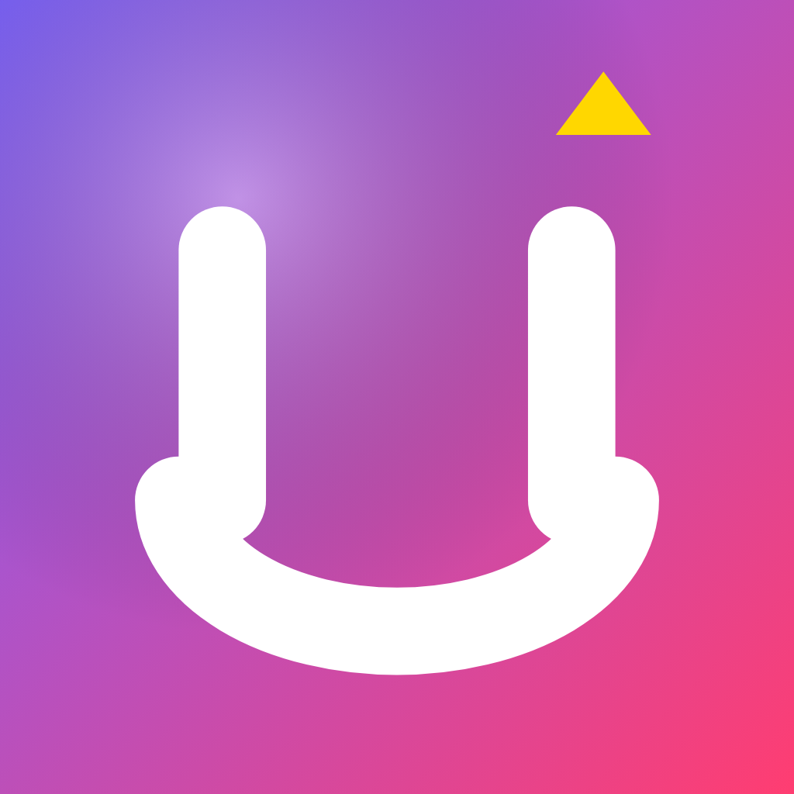
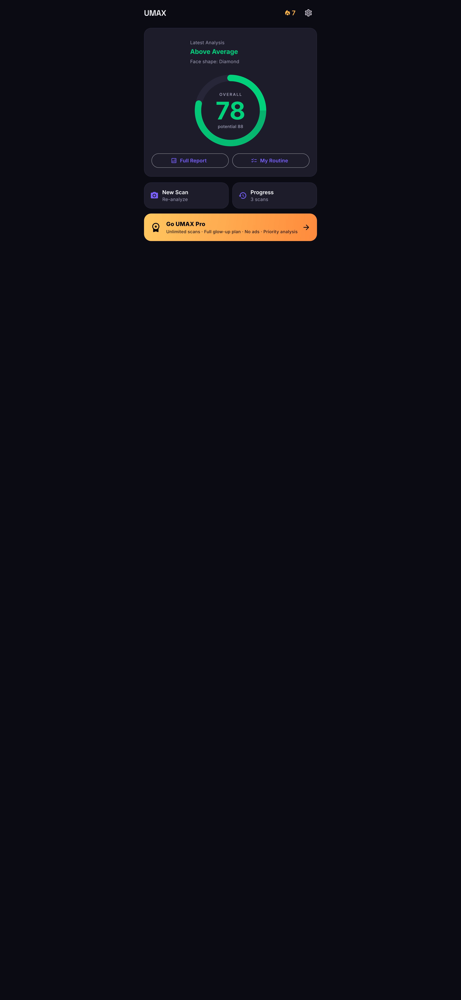
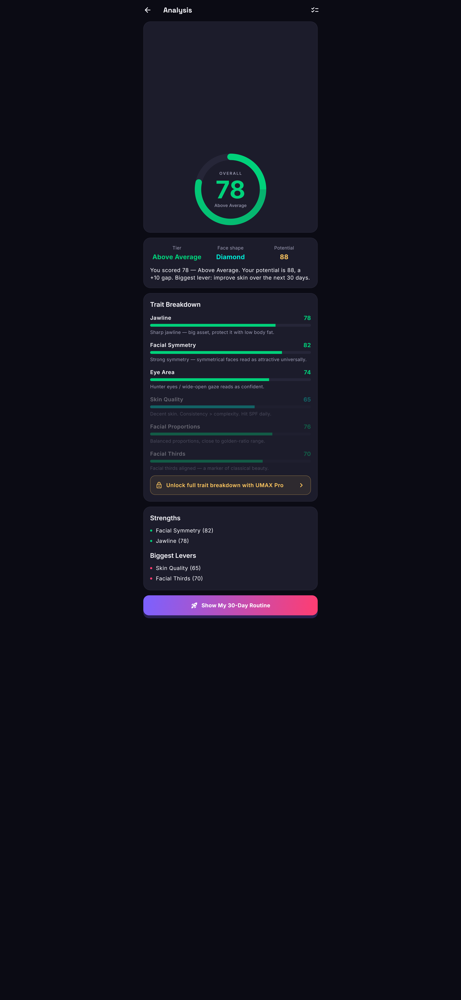
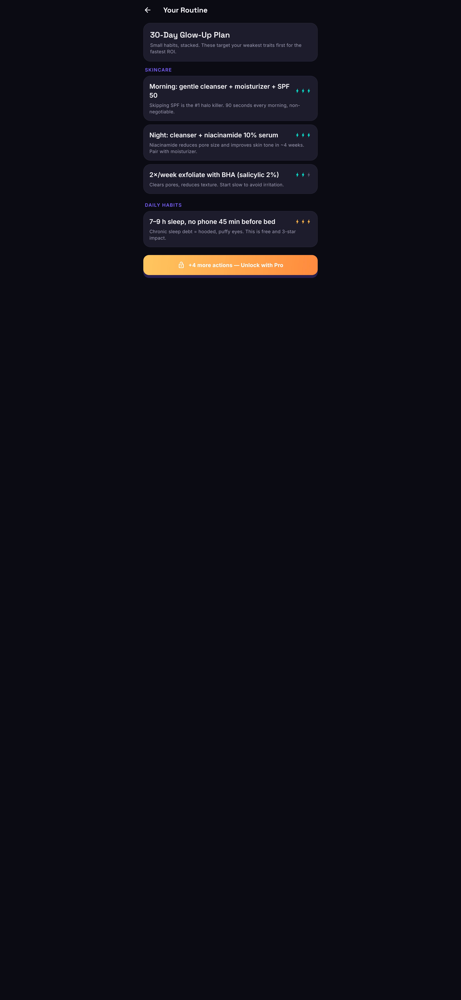
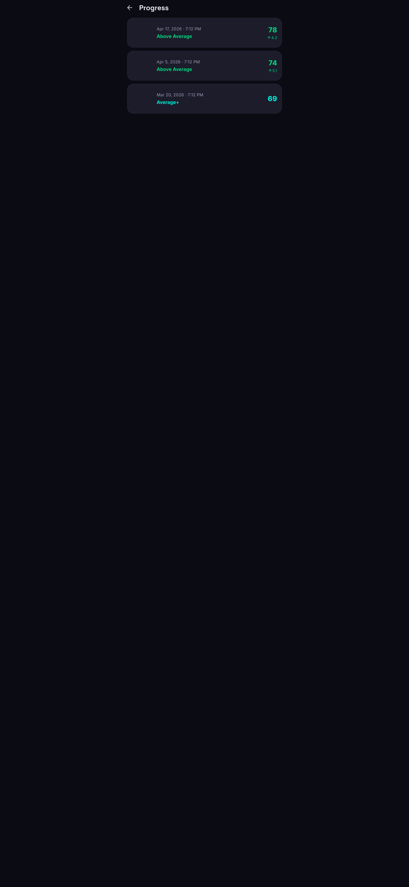
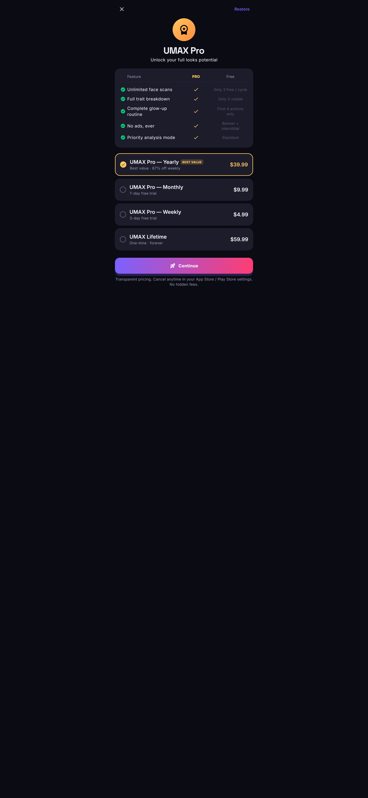

# UMAX — AI Looksmax & Face Analysis

> Rate your looks, track your glow-up, level up.

<p align="center">
  
</p>

<p align="center">
  
  
  
  
  
</p>

UMAX is a production-ready Flutter app that gives users an objective, **on-device** AI analysis of their face across six traits (jawline, symmetry, eyes, skin, proportions, facial thirds), a tier rating, a 30-day glow-up routine tailored to their weakest traits, and progress-over-time tracking.

## Competitive angle

The looksmaxxing niche (Umax, Looksmax AI, Youmax, UCHAD, …) is dominated by apps that lock everything behind a weekly paywall after one free scan, hide pricing until the user is invested, and ship shallow "here's a number" results.

UMAX exploits those weaknesses:

- **3 free scans, no credit card, no hidden pricing.** All subscription options (weekly / monthly / yearly / lifetime) shown upfront with honest savings math.
- **Actionable 30-day routine** generated from the user's weakest traits — skincare, grooming, training, habits.
- **Progress tracking** — every scan is stored locally with a before/after timeline on the home screen.
- **Private by design** — face landmark detection runs locally via Google ML Kit. Photos never leave the phone.
- **Rewarded ads** unlock extra scans instead of forcing a subscription decision at the first wall.

## Tech stack

| Concern | Library |
|---|---|
| State management | `flutter_riverpod ^3.2.1` (Notifier pattern) |
| Persistence | `shared_preferences ^2.5.0` + JSON |
| Face analysis | `google_mlkit_face_detection ^0.13.0` (on-device, free) |
| Image pick | `image_picker ^1.1.2` |
| Ads | `google_mobile_ads ^5.3.0` (banner + interstitial + rewarded) |
| IAP | `in_app_purchase ^3.2.0` |
| Fonts | Inter + Space Grotesk bundled in `assets/fonts/` |

## Quick start

```bash
flutter pub get
flutter run
```

The app ships with **Google's AdMob test IDs** so it runs out of the box — swap in real IDs before release.

## Regenerating store assets

All store PNGs are committed under `store_assets/`. Regenerate them by running:

```bash
# 10 phone screenshots (5 scenes × 2 sizes)
flutter test --tags=screenshot test/screenshot_test.dart

# app icon + Play Store feature graphic
flutter test --tags=assets test/generate_assets_test.dart

# materialize iOS + Android platform icons from assets/icon/icon_source.png
dart run flutter_launcher_icons
```

## Store listings

Ready-to-paste copy lives in `store/`:
- [`store/ios_listing.md`](store/ios_listing.md) — App Store Connect
- [`store/android_listing.md`](store/android_listing.md) — Google Play Console

## Deployment

See [`RELEASE.md`](RELEASE.md) for the Codemagic → TestFlight + Play Store runbook. Trigger a release with a tag:

```bash
git tag v1.0.0 && git push origin v1.0.0
```

## Pre-release checklist

- [ ] Replace AdMob test IDs with real ones (`lib/core/constants/ad_ids.dart`, `AndroidManifest.xml`, `Info.plist`)
- [ ] Create App Store Connect + Play Console records and the 4 IAP products
- [ ] Host `PRIVACY.md` at a public URL
- [ ] Generate Android keystore + `android/key.properties` from template
- [ ] Connect repo to Codemagic
- [ ] Tag a release

## License

Proprietary — © Ideal AI.
